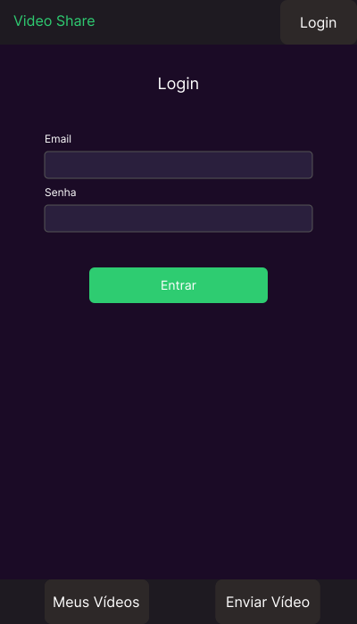
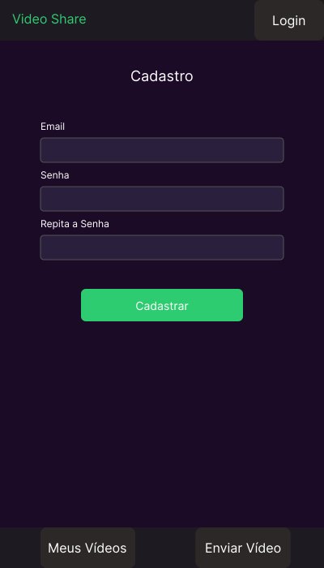
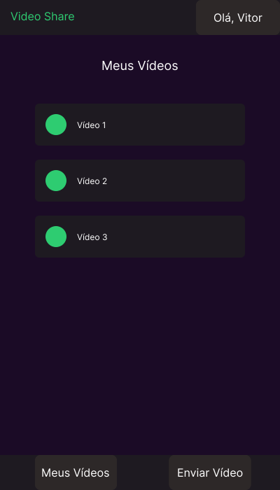
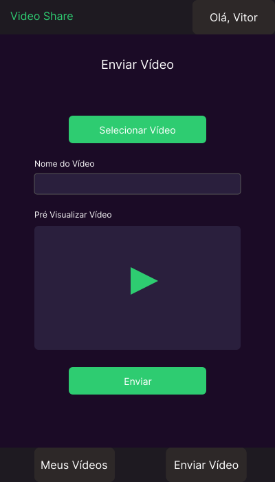
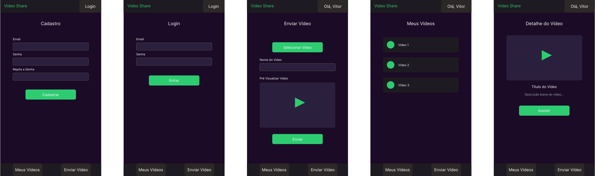

# Projeto Aplicativo Mobile: VideoShare

- **Aluno(a):** Vitor Mateus Weirich (weirichvitor@gmail.com)
- **Turma:** EAD54-12
- **Professor(a):** Alysson Oliveira
- **Disciplina:** 28743 - DESENVOLVIMENTO MOBILE

Esse arquivo juntamento com os demais arquivos do projeto (autalmente incompletos) estão acessíveis no [github](<https://github.com/vitorweirich/video-share-mobile/blob/master/layout%20(Protótipo)/Requisitos%20e%20Propósta%20de%20Layout%20(Protótipo).md>)

---

## 1. Requisitos do Aplicativo

### 1.1. Requisitos Funcionais

- **Autenticação de Usuário:**

  - **Login:** Permitir que usuários existentes façam login com e-mail e senha.
  - **Cadastro:** Permitir que novos usuários se cadastrem fornecendo e-mail e senha (com confirmação de senha).

- **Gerenciamento de Vídeos:**
  - **Listagem de Vídeos:** Exibir uma lista dos vídeos do usuário (Meus Vídeos).
  - **Visualização de Vídeo:** Permitir a visualização de um vídeo selecionado, exibindo título e descrição.
  - **Envio de Vídeo:** Permitir que o usuário selecione um vídeo do dispositivo, forneça um título e o envie para a plataforma.

### 1.2. Requisitos Não Funcionais

- **Usabilidade:** A interface deve ser intuitiva e fácil de usar.
- **Desempenho:** O aplicativo deve ser responsivo e carregar informações rapidamente.
- **Segurança:** Credenciais e dados dos usuários devem ser protegidos.
- **Compatibilidade:** O aplicativo deve ser compatível com iOS e Android.

## 2.Escolha da Plataforma de Desenvolvimento: React Native

Para o desenvolvimento do **VideoShare**, escolhemos a plataforma **React Native**. As principais justificativas são:

- **Desenvolvimento Multiplataforma:** Permite criar aplicativos para iOS e Android a partir de uma única base de código, reduzindo tempo e custos de desenvolvimento. Como o objetivo é atingir o maior número de usuários, essa é a melhor escolha.
- **Familiaridade com JavaScript/TypeScript:** A equipe (no caso, eu) já possui experiência com essas linguagens, diminuindo a curva de aprendizado.
- **Desempenho Próximo ao Nativo:** Embora seja uma estrutura híbrida, o React Native utiliza componentes nativos. Apesar de não alcançar a performance de um desenvolvimento totalmente nativo, considerando a falta de experiência em iOS e Android nativos, essa abordagem tende a resultar em um desempenho melhor no projeto.
- **Ecossistema Rico e Comunidade Ativa:** A vasta quantidade de bibliotecas e a comunidade ativa facilitam o desenvolvimento e a resolução de problemas.
- **Componentização:** A arquitetura baseada em componentes favorece modularidade, reuso de código e manutenção mais simples, além de facilitar a evolução do aplicativo.

## 3. Protótipo: Wireframes/Mockups

A seguir, os mockups que ilustram a interface e as principais funcionalidades do **VideoShare**.

### 3.1. Tela de Login

Permite que os usuários existentes acessem suas contas.  

### 3.2. Tela de Cadastro

Tela de registro de novos usuários.  

### 3.3. Tela de Listagem de Vídeos (Meus Vídeos)

Exibe a lista de vídeos enviados pelo usuário.  

### 3.4. Tela de Envio de Vídeo

Permite selecionar e enviar um novo vídeo para a plataforma.  

### 3.5. Tela de Visualização de Vídeo

Apresenta os detalhes de um vídeo selecionado e permite sua reprodução.  

## 4. Todas as telas juntas

